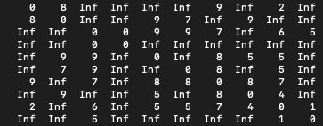
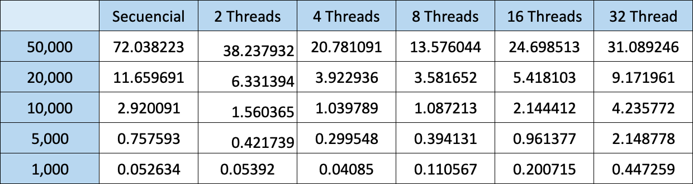
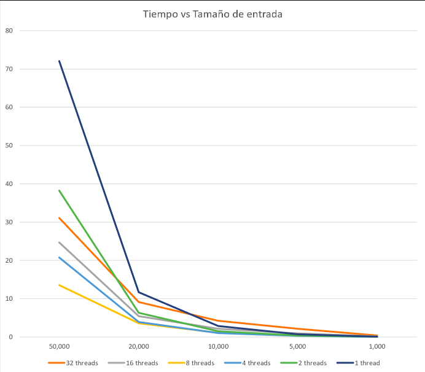
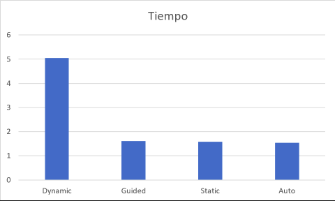

# [Dijkstra secuencial y en paralelo]
---
#### Materia: Análisis y Diseño de Algoritmos (TC2017)

#### Semestre: Otoño 2019

##### Campus: Santa Fe

##### Integrantes:
1. [Sebastián Medina Medina] [A00822311]
2. [Carlos de la Garza] [A01024712]

---
## 1. Aspectos generales

### 1.1 Requerimientos

A continuación se mencionan los requerimientos mínimos del proyecto, favor de tenerlos presente para que cumpla con todos.

* El equipo tiene la libertad de elegir el problema a resolver.
* El proyecto deberá utilizar [OpenMP](https://www.openmp.org/) para la implementación del código paralelo.
* Todo el código y la documentación del proyecto debe alojarse en este repositorio de GitHub. Favor de mantener la estructura de carpetas propuesta.

### 1.2 Estructura del repositorio
El proyecto debe seguir la siguiente estructura de carpetas:

- / 			        # Raíz de todo el proyecto
    - README.md			# este archivo
    - secuencial		# Carpeta con la solución secuencial
    - paralelo			# Carpeta con la solución paralela
    - docs              # Carpeta con los documentos, tablas, gráficas, imágenes


### 1.3 Documentación  del proyecto

Como parte de la entrega final del proyecto, se debe incluir la siguiente información:

* Descripción del problema a resolver.
* Descripción de la solución secuencial con referencia (enlace) al código secuencial alojado en la carpeta [secuencial](secuencial/).
* Análisis de los inhibidores de paralelismo presente y una explicación de cómo se solucionaron.
* Descripción de la solución paralela con referencia (enlace) al código paralelo alojado en la carpeta [paralelo](paralelo/).
* Tabla de resultados con los tiempos de ejecución medidos para cada variante de la solución secuencial vs. la solución paralela, teniendo en cuenta: 5 tamaños diferentes de las entradas, 5 opciones diferentes de números de CPU (threads), 4 ocpiones diferentes de balanceo (auto, guided, static, dynamic).
* Gráfica(s) comparativa(s) de los resultados obtenidos en las mediciones.
* Interpretación de los resultados obtenidos.
* Guía paso a paso para la ejecución del código y replicar los resultados obtenidos.
* El código debe estar documentado siguiendo los estándares definidos para el lenguaje de programación seleccionado.

## 2. Descripción del problema

El algoritmo de Dijkstra, creado por el científico Edseger Dijkstra en 1956, es un algoritmo que busca los caminos más cortos de un grafo, saliendo desde un vértice único hacia todos los vertices restantes del grafo (NIST, 2006). La manera en la que el algoritmo escoge su camino es por medio de los valores del peso de las aristas, específicamente los menores.

En sí, el algoritmo de Dijkstra, funciona como una especialización de la [búsqueda de costo uniforme](https://algorithmicthoughts.wordpress.com/2012/12/15/artificial-intelligence-uniform-cost-searchucs/). Una característica básica del algoritmo, es que no funciona con aristas de coste negativo. El proyecto tiene la finalidad de comparar el rendimiento del algoritmo de Dijkstra en forma secuencial y en paralelo

## 3. Solución secuencial

1. Se crea una matriz de NxN lados de forma aleatoria.
    1. Los valores de la matriz que pertenezcan a la diagonal partiendo del punto matriz[0][0] al matriz[N][N] tienen que valer 0.
    2. No todos los valores (exceptuando la diagonal) tienen que tener un número aleatoria del rango que se escoga, ya que no todos los nodos tienen unión. Para esto, se le asigna a algunos valores i4_huge = 2147483647 o inf.
    3. Los valores deben ser simétricos a la otra mitad.
    4. El rango de los valores que se introducen al azar son entre 0 y N para poder mostrar un resultado fijo. 
    
*NOTA:* La matriz que se genere con un N valores, será la misma siempre. Es decir, el tiempo de ejecucción y el rendimiento no depende de los valores de la matriz, sino del algoritmo de Dijkstra.

Ejemplo de matriz que se genera (10x10):



2. Se inicia la construcción de un un árbol con el nodo 0 de inicio. (Esto puede ser editado dentro del código).
3. Se busca entre **todos los nodos no conectados** al árbol el nodo cuya distancia es menor. Una vez seleccionado, se conecta al árbol.
4. Se verifica que la distancia ya registrada, sea la más pequeña entre **todos los nodos no conectados**. Si es así, se intercambian los valores. 
5. Una vez todos los nodos conectados a 0, se calculan las distancias mínimas del nodo 0 a todos los nodos restantes.
6. La distancia mínima del 0 a cada nodo respectivamente se imprime y la matriz original se imprime. 

[Link al código](https://github.com/tec-csf/TC2017-PF-Otono-2019-equipocs/blob/master/Secuencial/dijkstra.c)

## 4. Análisis de los inhibidores del paralelismo

Durante el proceso de paralización encontramos ciertos inhibidores que destacaron:

1. Nuestro código y la mayoría de los algoritmos de grafos, necesitan de la implementación de ```#pragma omp barrier``` para poder funcionar adecuadamente. Esta función sirve específicamente para evitar que algún thread siga ejecutando sin que los demás no hayan terminado el proceso anterior. Claramente, el tiempo de ejecucción es mayor. Existe una forma de evitarlos y es con la función de ```nowait``` que va tanto en un ```#pragma omp parallel for``` como en un ```#pragma omp sections```. 

Como nuestro código no está paralelizado en función a un ```for```, sino a una región del código, la única solución era la implementación de ```#pragma omp sections nowait```. Sin embargo, no puede existir un ```#pragma omp single``` dentro, ya que su función es ejecutar su interior solamente por un thread; lo contrario a la función de ```nowait```.

Si se eliminan los ```#pragma omp single```, el resultado es alterado el número de threads que el usuario seleccionó. 

2. Como se mencionó previamente, el código no se paralelizó conforme un loop, sino conforme a una región importante. Esto fue porque es necesario la intervención de funciones directivas de OMP como *critical, single* y *barrier*

3. Para utilizar el balanceo de ```shedule()``` era necesario ubicarlo en un for. Para eficientizar el proceso de paralelización se implementó en los métodos de *buscar el más cercano* y el de *actualizar la distancia mínima*. El resultado de esto no es muy notorio si no se utiliza ninguno, exceptuando ```shedule(dynamic)``` que tarda más tiempo en ejecutarse.

## 5. Solución paralela

1. Se crea una matriz de NxN lados de forma aleatoria.
    1. Los valores de la matriz que pertenezcan a la diagonal partiendo del punto matriz[0][0] al matriz[N][N] tienen que valer 0.
    2. No todos los valores (exceptuando la diagonal) tienen que tener un número aleatoria del rango que se escoga, ya que no todos los nodos tienen unión. Para esto, se le asigna a algunos valores i4_huge = 2147483647 o inf.
    3. Los valores deben ser simétricos a la otra mitad.
    4. El rango de los valores que se introducen al azar son entre 0 y N para poder mostrar un resultado fijo. 
    
*NOTA:* La matriz que se genere con un N valores, será la misma siempre. Es decir, el tiempo de ejecucción y el rendimiento no depende de los valores de la matriz, sino del algoritmo de Dijkstra.

Ejemplo de matriz que se genera (10x10):


A diferencia con la solución secuencial, la solución paralela fue de la siguiente forma:

2. Se inicia la construcción de un un árbol con el nodo 0 de inicio. (Esto puede ser editado dentro del código). 
3. El número de nodos asignados, son divididas entre la cantidad de threads que el usuario asigne. Ej:
 
       Se asigna 10,000 valores de entrada en la variable N
 
       $ export OMP_NUM_THREADS=8
       $ ./a.out
       
       Output
       
       P2:  Primer valor=2500  Último valor=3749
       P1:  Primer valor=1250  Último valor=2499
       P3:  Primer valor=3750  Último valor=4999
       P4:  Primer valor=5000  Último valor=6249
       P0:  Primer valor=0     Último valor=1249
       P6:  Primer valor=7500  Último valor=8749
       P5:  Primer valor=6250  Último valor=7499
       P7:  Primer valor=8750  Último valor=9999

3. Cada thread ejecuta individualmente la búsqueda de la distancia menor al nodo 0. En este paso, los threads se ejecutan al mismo tiempo.
4. Los threads pasan a verificar que la distancia de sus nodos ya registrada, sea la más pequeña al nodo 0. Si no es la más pequeña, se sustituyen los valores. Esta operación la hacen una a la vez. 
5. En caso de que algún thread haya encontrado un nodo sin conexión, se asigna un valor de inf.
6. Una vez que todos los nodos de cada thread estén conectados a el nodo 0 (por lo tanto ordenados), se busca una distancia mas corta usando los grupos restantes. En este paso, los threads se ejecutan individualmente y se va juntando los distintos grupos de nodos (Ya que los nodos ya estan ordenados esto puede hacer que el agoritmo vaya mas rapido).
7. Una vez que todos los nodos estan ordenados, La matriz y la distancia mínima del al nodo cero se imprimen respectivamente.

[Link al código](https://github.com/tec-csf/TC2017-PF-Otono-2019-equipocs/blob/master/Paralelo/dijkstraPar.c)

## 6. Tabla de resultados

A continuación estará la tabla de los resultados de los tiempos de ejecucción conforme al número de entradas y a los threads que disponía la compilación del algoritmo de Dijkstra.



Para comparar el rendimiento del balanceo, se hizo una prueba con un número de entrada de 10,000 nodos y se utilizo el número de threads por default: 4. Estos fueron los resultados:

| Tipo de scheduler| Tiempo |
| ------------- | ------------- |
| Dynamic  | 5.0482 segundos  |
| Guided | 1.60632 segundos  |
| Static  | 1.57927 segundos |
|  Auto |  1.54247 segundos |


## 7. Gráfica(s) comparativa(s)

Relación de tiempo con el número de entradas.



Relación del balanceo con el tiempo de ejecucción.



## 8. Interpretación de los resultados

Una vez ejecutado todos las entradas con diferentes threads se pueden interpretar las siguientes cosas:

* Mientras el número de threads sea mayor y el número de entradas sea muy grande, el tiempo de ejecucción será más rápido. **¿Por qué?** Al tener muchos nodos que puedan ser almacenados en diferentes threads y que las tareas de *buscar al más cercano* y *actualizar la menor distancia* se puedan ejecutar al mismo tiempo, ahorra mayor tiempo. **
* Mientras el número de threads sea menor y el número de entradas sea muy pequeño, el tiempo de ejecucción será más rápido. De hecho. múltiples algoritmos tienen mejor eficiencia al ser secuenciales cuando se cuenta con pocas N entradas.
* Mientras el número de threads sea menor y el número de entradas sea mayor y viceversa, el tiempo de ejecucción tomará mucho tiempo.
* El balanceo más rápido registrado con 10,000 entradas fue el de *auto*, el cual es el que ejecuta por default. Muy cerca de *auto*, se encuentra *static* y *guided* que tienen una estructura muy similar al ejecturar un for.
* El algoritmo de Dijkstra no permite que su balanceo se ejecute de forma dinámica, ya que alarga el tiempo casi 4 veces más.

Un algoritmo que manipule un grafo, es muy complejo de paralelizar, ya que no se pueden ejecutar diferentes tareas simultáneamente por la dependencia que tienen con los nodos conectados. En el caso de Dijkstra, ciertos métodos generan una ventaja al paralizar porque no requiere de ninguna dependencia. 

** Es importante aclarar, que la velocidad en parte depende de como están acomodados los valores de la matriz y cómo se divide entre los threads. En este caso, el tiempo mejoró cuando se ejecutaron 8 threads y 50,000 entradas. Esto pasa porque al paralelizar el algoritmo las entradas se dividen entre el numero de threads y se crean grupos. Separar los nodos por threads puede mejorar el tiempo que toma solucionar el algoritmo siempre y cuando no se sobre separen los nodos. Los grupos de nodos se van ordenando conforme a su nodo inicial por los threads paralelamente. Sin embargo, cuando se juntan todos los grupos de nodos y se ordenan esto se hace secuencialmente por lo tanto separar los nodos en demasiados grupos puede hacer que el algoritmo se tarde mas en llevarse acabo. 

## 9. Guía paso a paso

1. Clonar la carpeta en tu ordenador. ¡
2. Abrir la terminal en donde podrá ejecutar lineas de comando. 
    1. **IMPORTANTE:** debe tener instalado la última versión de gcc (en este caso debe ser la versión 9).
3. Dentro de cada código, existe una variable definida al inicio llamada N. Ahí se puede manipular el número de entradas que se desean tener en la matriz. 

# Secuencial:

1. Para correr el código secuencial que se llama "dijkstra.c" debe de ingresar los siguientes comandos:

        $ gcc dijkstra.c
        $ ./a.out
        

# Paralelo:

1. Para correr el código paralelo que se llama "dijkstraPar.c" debe de ingresar los siguientes comandos:

        $ gcc-9 -fopenmp dijkstra.c
        $ ./a.out
        
2. Para manipular el número de threads que desea, escribir la línea de comando ```$ export OMP_NUM_THREADS=<Número>``` previo al ```./a.out```. Mayor información revisar referencia [4].
3. Para manipular el balanceo del algoritmo, escribir la línea de comando ```$ export OMP_SCHEDULE=<Balanceo>``` previo al ```./a.out```. Mayor información revisar referencia [1].
        


## 10. Referencias

[1] OpenMP: For & Scheduling. (2016, 13 junio). Recuperado 26 noviembre, 2019, de http://jakascorner.com/blog/2016/06/omp-for-scheduling.html

[2] OpenMP: Barrier. (2016, 11 junio). Recuperado 26 noviembre, 2019, de http://jakascorner.com/blog/2016/07/omp-barrier.html

[3] DIJKSTRA_OPENMP - Dijkstra Graph Distance Algorithm using OpenMP. (2010, 2 julio). Recuperado 26 noviembre, 2019, de https://people.sc.fsu.edu/%7Ejburkardt/c_src/dijkstra_openmp/dijkstra_openmp.html

[4] OpenMP: Introduction. (2016, 25 abril). Recuperado 26 noviembre, 2019, de http://jakascorner.com/blog/2016/04/omp-introduction.html


